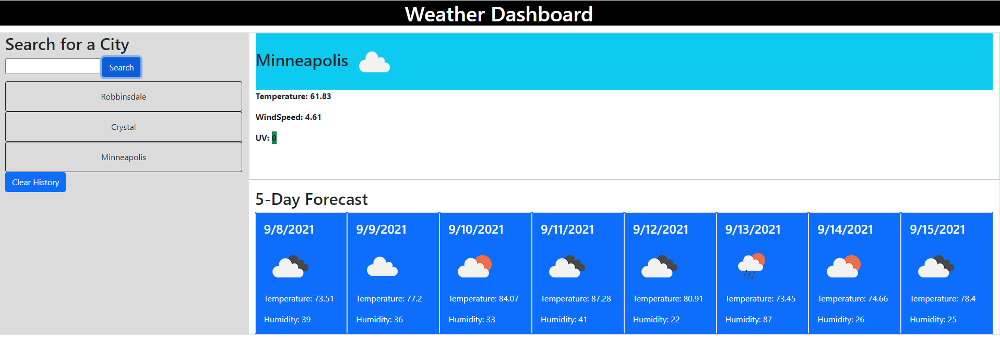

 # Weather Dashboard
### License
GitHub 
* [Installation](#Installation)
* [Usage](#usage)
* [Test](#test)
* [Credits](#credits)

## __Description__
Shows you the weather of a city both the current and 5 day forecast

## __Installation__
Just open up the page https://pepsi1397.github.io/Weather_Dashboard/

## __usage__
Checking out the weather of a city

## __IMG__

## __Credits__
NA

* GitHub: [pepsi1397](https://github.com/pepsi1397)

* E-mail: [NA](NA)